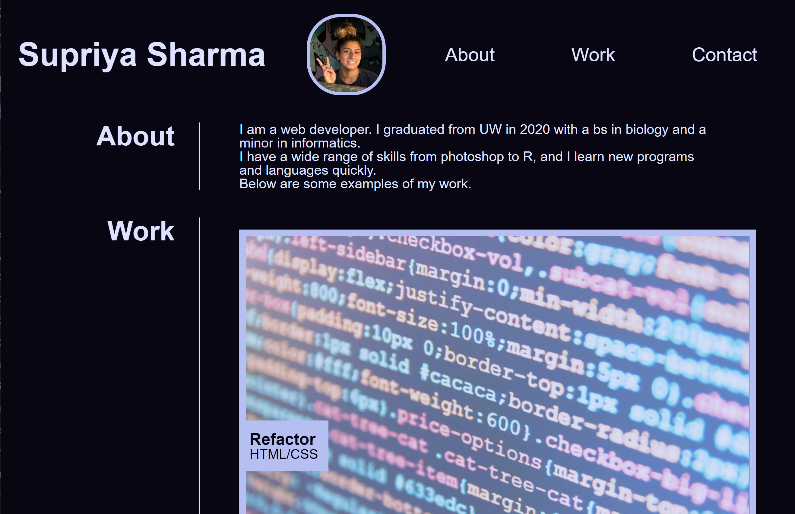
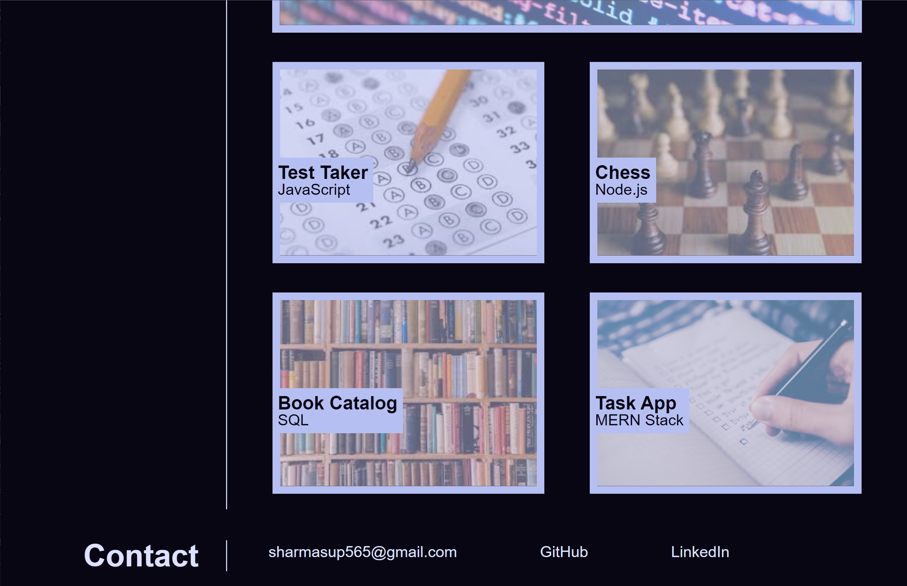

# project-portfolio

## Description

**Goal:** To create an interactive and dynamic web page to showcase my projects and give myself background to potential employers.

It is important as a web developer to put your projects on display if you want to be noticed and have your skills recognized. Especially if you are looking for a job, it is cruicial to emphasize your strongest work and share your thought processes.

## Development

1. Created a wireframe for web page layout based on the mock-up provided. Mapped elements.
1. Created necessary files including an HTML index, a styling CSS file, and a reset CSS file.
1. Coded basic format into HTML using semantic elements. Entered content including text, links, images, etc.
1. Formatted page in CSS to be user-friendly, responsive, and dynamic.
1. Polished code and added descriptive comments.

[Deployed Webpage](https://supsha878.github.io/project-portfolio/)